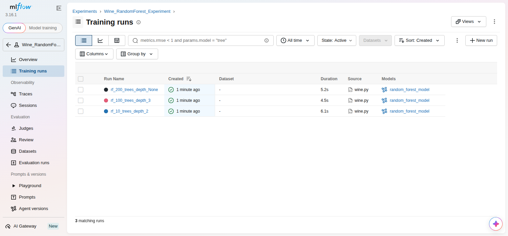
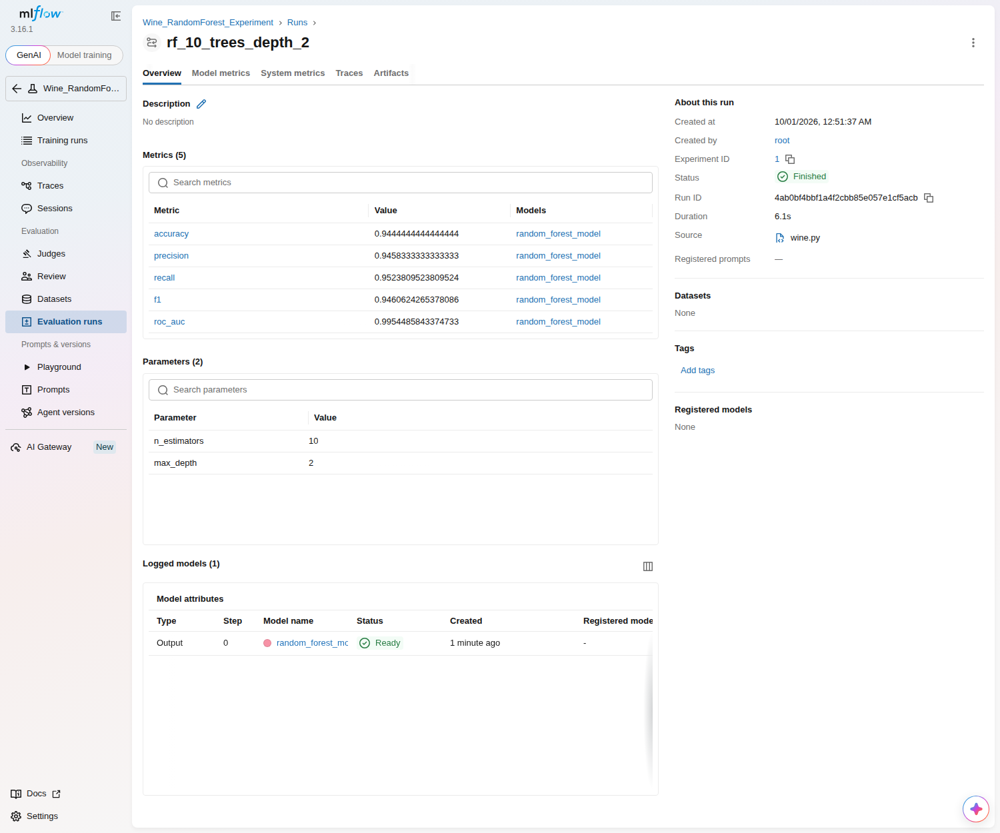
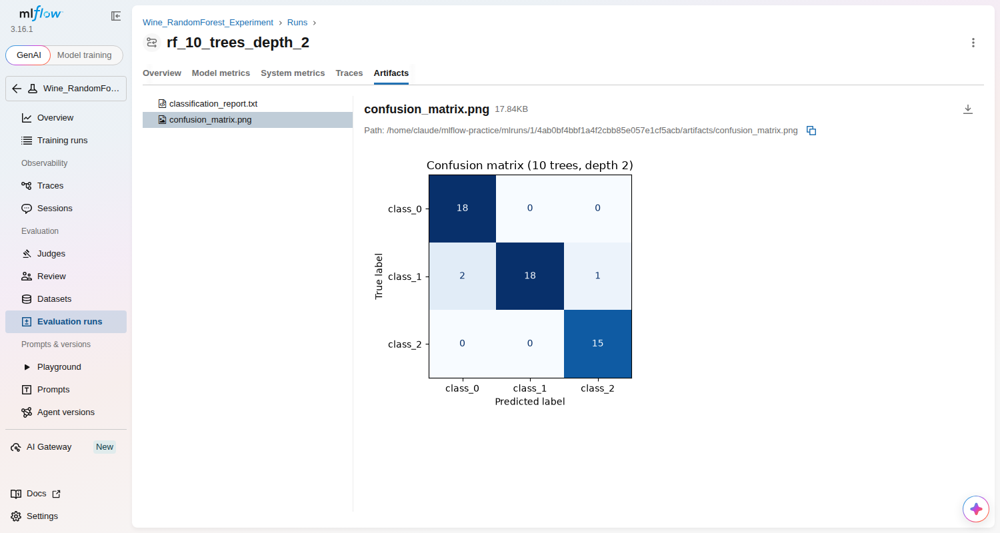

# MLflow practice: tracking a machine learning experiment

Author: Aman Priyansh (PES1UG24AM030)

This repo does the **MLflow tutorial** task:

1. `pip install mlflow`
2. Write any machine learning program and save it as `wine.py`
3. Run `mlflow ui`
4. See the results in the browser

## What is in here

| File | What it does |
|---|---|
| `wine.py` | Trains a Random Forest on the Wine dataset (178 wines, 3 grape types) with 3 different settings, and logs each run to MLflow |
| `wine_autolog.py` | The quickstart from the second MLflow document: MLflow **autologging**, then **loading the saved model back** from MLflow and predicting with it |

For every run `wine.py` records:

| MLflow calls it | What we log |
|---|---|
| Parameters | `n_estimators`, `max_depth` |
| Metrics | accuracy, precision, recall, F1-score, ROC-AUC |
| Artifacts | confusion matrix picture, classification report |
| Model | the trained model, saved as `random_forest_model` |

## Results

| Run | n_estimators | max_depth | Accuracy | Precision | Recall | F1 | ROC-AUC |
|---|---|---|---|---|---|---|---|
| rf_10_trees_depth_2 | 10 | 2 | 0.944 | 0.946 | 0.952 | 0.946 | 0.995 |
| rf_100_trees_depth_3 | 100 | 3 | 1.000 | 1.000 | 1.000 | 1.000 | 1.000 |
| rf_200_trees_depth_None | 200 | None | 1.000 | 1.000 | 1.000 | 1.000 | 1.000 |

(Precision, recall and F1 are "macro" averages over the 3 classes; ROC-AUC is one-vs-rest.)
The Wine dataset is easy, so the bigger forests get every test wine right.

`wine_autolog.py` output:

```
Model and metrics logged automatically!
Loaded runs:/<run_id>/model
First 10 predictions: [0, 0, 2, 0, 1, 0, 1, 2, 1, 2]
Accuracy of the loaded model on the test set: 1.0000
```

## Screenshots

The three runs in the MLflow UI:



One run, with its parameters and metrics:



The confusion matrix saved as an artifact:



## Try it yourself

```
git clone https://github.com/AMAN-PRIYANSH/mlflow-practice.git
cd mlflow-practice
pip install -r requirements.txt
python wine.py
python wine_autolog.py
mlflow ui                      # then open http://127.0.0.1:5000
```

MLflow saves the runs in `mlflow.db` (the backend store) and the files in `mlruns/`
(the artifact store) inside this folder. They are not uploaded to GitHub, because they
are created again every time you run the scripts.
